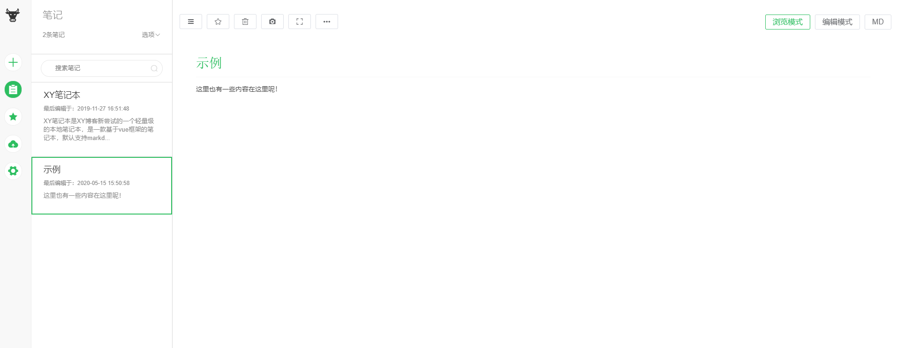
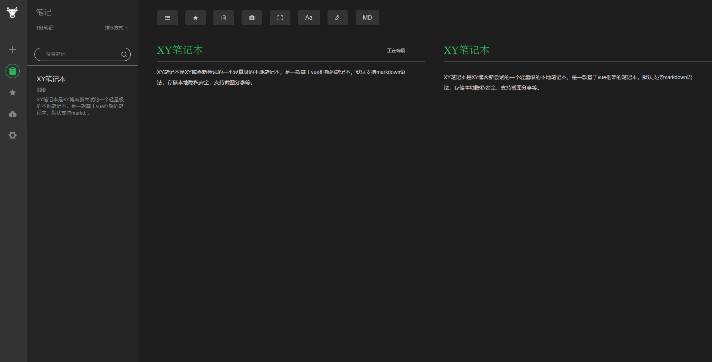
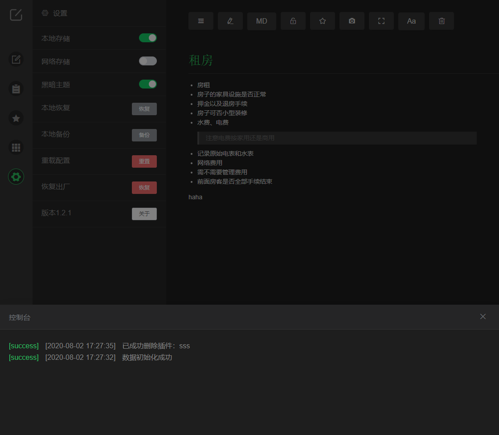

# 【此版本将不会更新功能，请移到master分支使用】

# XY笔记2.0

XY笔记本是XY博客新尝试的一个轻量级的本地笔记本，是一款基于vue框架的笔记本，默认支持markdown语法，存储本地隐私安全，支持截图分享等。


## [最新地址](https://notes.xygeng.cn)


## 提示

> v2临时网站用于迁移数据到v3：https://notes.xygeng.cn/v2


## 功能：

- 支持markdown编辑
- 支持双屏编辑模式
- 支持截图分享
- 支持本地存储，无网络
- 支持本地备份和恢复
- 支持修改字体
- 支持移动端


## 截图：

- 正常模式



- 黑暗主题



- 移动端


- 控制面板



## 更新：

### 2.0.2版本更新(2022.05.28)

+ 兼容v3版本数据迁移
### 1.2.1版本更新(2020.08.02)

#### 修改：

+ 修改生产环境加载插件的异步问题
+ 修改路由的移动端设备判断问题
+ 修改黑暗主题样式

#### 新功能：

+ 增加插件加载状态显示
+ 增加控制台显示日志
+ 控制台只支持pc端，在页面左下角
+ 增加日志记录用户操作记录，不保存本地

### 1.2.0版本更新(2020.08.01)

#### 修改：

+ 修改刷新排序逻辑
+ 修改刷新后首次打开的笔记
+ 修改markdown语法的checkbox样式
+ 修改表格样式
+ 增加scss的支持
+ 整理代码命名格式
+ 修改logo
+ 修改诸多旧bug

#### 新功能：

+ 增加插件库，可新增插件，插件配置
+ 增加版本介绍
+ 增加插件文档
+ 增加笔记加密
+ 增加插件自定义页面
+ 增加诸多未知bug
+ 增加双击编辑

## 运行：

### 初始化
```
npm install
```
### 启动
```
npm start
```
### 打包
```
npm run build
```
