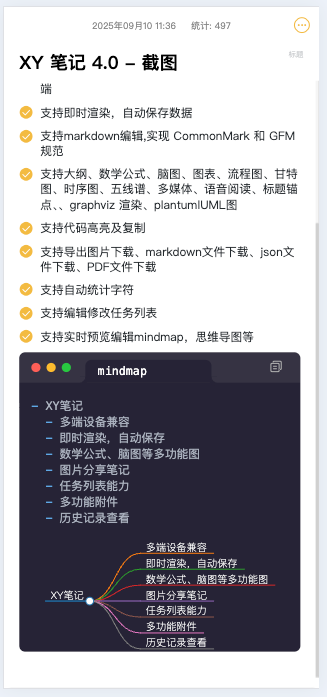
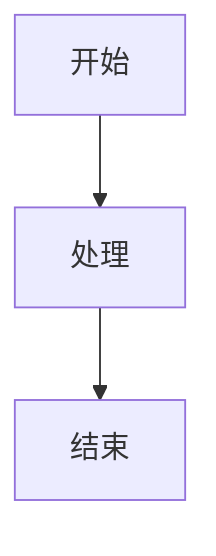

<div align="center">

# XY Notes 4.0

一款基于 Vue.js 的现代化本地笔记本应用，支持多端使用和丰富的文档编辑功能

[](https://vuejs.org/)
[](LICENSE)
[](https://github.com/xygengcn/XYNotes/stargazers)
[](https://github.com/xygengcn/XYNotes/network/members)

[在线演示](https://demo.notes.xygeng.cn) • [报告问题](https://github.com/xygengcn/XYNotes/issues) • [功能请求](https://github.com/xygengcn/XYNotes/issues)

</div>

## 简介

XY Notes 是一款轻量级的本地笔记本应用，专为开发者和内容创作者设计。基于 Vue.js 框架构建，所有数据存储在本地浏览器中，无需服务器支持。默认支持 Markdown 语法，并提供丰富的扩展功能，包括数学公式、图表绘制、思维导图等，满足多样化的笔记需求。

## 特性

### 📱 多端适配

- 支持移动端、桌面客户端和 Web 端使用
- 响应式设计，适配各种屏幕尺寸
- 跨平台一致性体验

### ⚡ 即时渲染与自动保存

- 实时预览编辑内容
- 自动保存机制，防止数据丢失
- 流畅的编辑体验

### 📝 Markdown 支持

- 完整实现 CommonMark 和 GFM 规范
- 支持标准 Markdown 语法
- 丰富的扩展语法支持

### 🎨 丰富的内容元素

- **大纲导航** - 自动生成文档结构
- **数学公式** - LaTeX 数学公式渲染
- **思维导图** - 实时编辑和预览 Mindmap
- **图表绘制** - 支持流程图、甘特图、时序图
- **五线谱** - 音乐记谱支持
- **多媒体** - 嵌入音视频内容
- **Graphviz & PlantUML** - 专业图表渲染
- **代码高亮** - 多语言代码语法高亮
- **任务列表** - 可编辑的待办事项

### 📤 多种导出格式

- 图片下载 (PNG)
- Markdown 文件下载
- JSON 数据导出
- PDF 文档导出

### 📊 智能统计

- 实时字符统计
- 文档信息分析

## 效果图

<div align="center">


_XY Notes 编辑界面_


_XY Notes 编辑界面_

</div>

## 语法支持

### 基础 Markdown

XY Notes 完整支持标准 Markdown 语法，包括：

#### 标题

使用 `#` 到 `######` 创建六级标题：

```markdown
# 一级标题

## 二级标题

### 三级标题

#### 四级标题

##### 五级标题

###### 六级标题
```

#### 段落与换行

段落由一个或多个连续的文本行组成，段落间由一个或多个空行分隔。
要强制换行，在行尾添加两个或多个空格。

#### 强调

```markdown
_斜体_ 或 _斜体_
**粗体** 或 **粗体**
**_粗斜体_** 或 **_粗斜体_**
~~删除线~~
```

#### 列表

无序列表：

```markdown
- 项目 1
- 项目 2
  - 子项目 2.1
  - 子项目 2.2
```

有序列表：

```markdown
1. 第一项
2. 第二项
   1. 子项 2.1
   2. 子项 2.2
```

任务列表：

```markdown
- [x] 已完成任务
- [ ] 未完成任务
```

#### 链接与图片

```markdown
[链接文本](URL '可选标题')

```

#### 引用块

```markdown
> 这是一个引用块
>
> 可以跨越多行
```

#### 代码

行内代码：使用反引号包围 `code`

代码块：

````markdown
``​`javascript
console.log('Hello World');
​```
````

#### 表格

```markdown
| 列 1   | 列 2   | 列 3   |
| ------ | ------ | ------ |
| 内容 1 | 内容 2 | 内容 3 |
| 内容 4 | 内容 5 | 内容 6 |
```

#### 分割线

使用三个或更多 `*`、`-` 或 `_` 创建分割线：

```markdown
---
```

#### 脚注

```markdown
这是一个带有脚注的文本[^1]

[^1]: 这是脚注内容
```

### 数学公式

```
行内公式: $E = mc^2$
```

$E = mc^2$

```
块级公式:
$$
\int_{-\infty}^{\infty} e^{-x^2} dx = \sqrt{\pi}
$$
```

$$
\int_{-\infty}^{\infty} e^{-x^2} dx = \sqrt{\pi}
$$

### 代码块

```javascript
// 代码高亮示例
function hello() {
  console.log('Hello XY Notes!');
}
```

### 流程图 (Mermaid)



### 思维导图 (Markmap)

```markmap
# 主题
## 分支1
## 分支2
### 子分支
```

## 快速开始

### 环境要求

- Node.js >= 16.0
- pnpm >= 8.0

### 安装依赖

```bash
pnpm install
```

### Web 端开发

```bash
cd packages/web
pnpm run dev
```

### Web 端构建

```bash
cd packages/web
pnpm run build
```

### 桌面应用开发

```bash
cd packages/app
pnpm run dev
```

### 桌面应用构建

```bash
cd packages/app
pnpm run build
```

## 技术栈

- [Vue.js 3](https://vuejs.org/)
- [Vite](https://vitejs.dev/)
- [TypeScript](https://www.typescriptlang.org/)
- [Marked](https://marked.js.org/)
- [Mermaid](https://mermaid-js.github.io/)
- [KaTeX](https://katex.org/)
- [Prism.js](https://prismjs.com/)

## 浏览器兼容性

| 浏览器  | 版本   |
| ------- | ------ |
| Chrome  | 最新版 |
| Firefox | 最新版 |
| Safari  | 最新版 |
| Edge    | 最新版 |

## 贡献

欢迎提交 Issue 和 Pull Request 来帮助改进 XY Notes！

1. Fork 本项目
2. 创建功能分支 (`git checkout -b main`)
3. 提交更改 (`git commit -m 'Add some amazing feature'`)
4. 推送到分支 (`git push origin main`)
5. 开启 Pull Request

## 许可证

本项目采用 MIT 许可证 - 查看 [LICENSE](LICENSE) 文件了解详情

## Star 历史

<!-- Star 历史图表占位符 -->
<div align="center">
  


</div>
