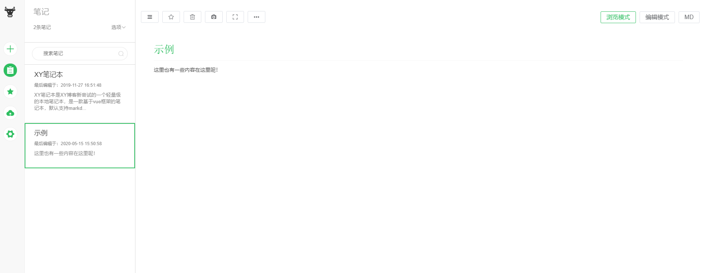

# xynotes

XY笔记本是XY博客新尝试的一个轻量级的本地笔记本，是一款基于vue框架的笔记本，默认支持markdown语法，存储本地隐私安全，支持截图分享等。

## 功能：

- 支持markdown编辑
- 支持双屏编辑模式
- 支持截图分享
- 支持本地存储，无网络化，更安全
- 支持本地备份和恢复

## 截图：




## 插件：

- "element-ui": "^2.13.1",
- "html2canvas": "^1.0.0-rc.5",
- "marked": "^1.0.0",

## 运行：

### Project setup
```
npm install
```

### Compiles and hot-reloads for development
```
npm start
```

### Compiles and minifies for production
```
npm run build
```
