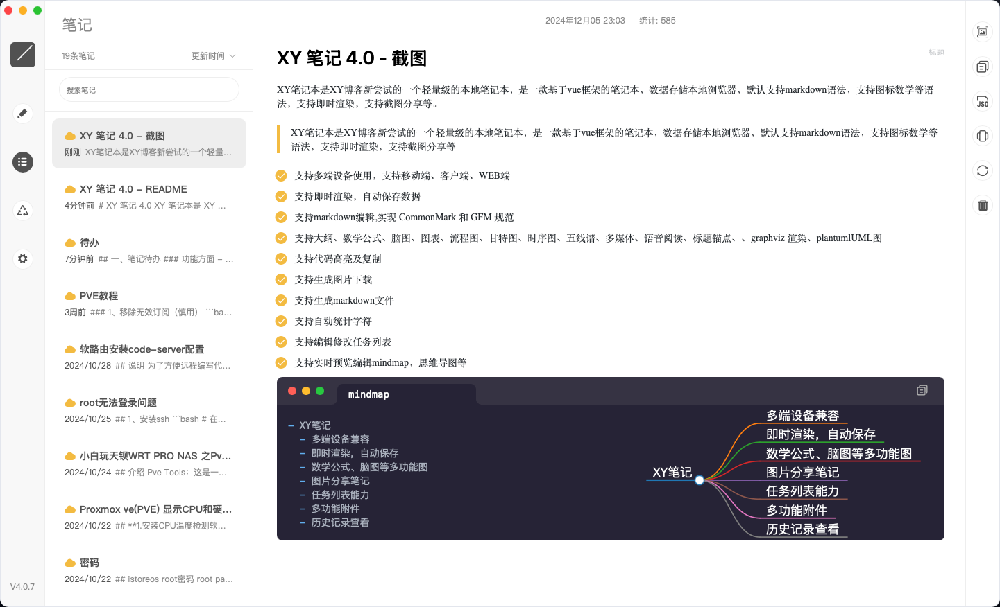

# XY 笔记 4.0

XY 笔记本是 XY 博客的一个轻量级的本地笔记本，是一款基于 vue 框架的笔记本，数据存储本地浏览器，默认支持 markdown 语法，支持图标数学等语法，支持即时渲染，支持截图分享等。

网站使用：[https://demo.notes.xygeng.cn](https://demo.notes.xygeng.cn)

## 功能：

- [x] 支持多端设备使用，支持移动端、客户端、WEB 端

- [x] 支持即时渲染，自动保存数据

- [x] 支持 markdown 编辑,实现 CommonMark 和 GFM 规范

- [x] 支持大纲、数学公式、脑图、图表、流程图、甘特图、时序图、五线谱、多媒体、语音阅读、标题锚点、、graphviz 渲染、plantumlUML 图

- [x] 支持代码高亮及复制

- [x] 支持生成图片下载

- [x] 支持生成 markdown 文件

- [x] 支持自动统计字符

- [x] 支持编辑修改任务列表

- [x] 支持实时预览编辑 mindmap，思维导图等

## 截图



## 编译打包

### 安装依赖（基于 node、yarn 环境）

```bash
pnpm install
```

### web 启动命令

```bash
cd packages/web

pnpm run dev
```

### web 打包命令

```bash
cd packages/web

pnpm run build
```

### app 启动命令

```bash
cd packages/app

pnpm run dev
```

### app 打包命令

```bash
cd packages/app

pnpm run build
```

### 上传服务器

> 产物为 dist 文件
