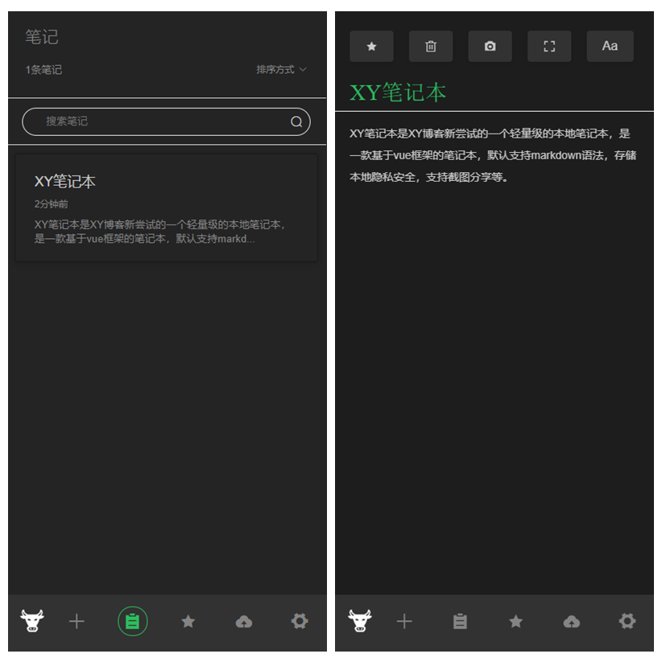

# xynotes

XY笔记本是XY博客新尝试的一个轻量级的本地笔记本，是一款基于vue框架的笔记本，默认支持markdown语法，存储本地隐私安全，支持截图分享等。

## 功能：

- 支持markdown编辑
- 支持双屏编辑模式
- 支持截图分享
- 支持本地存储，无网络
- 支持本地备份和恢复
- 支持修改字体
- 支持移动端
- 支持更换主题
- 支持插件


## 截图：

- 正常模式


- 黑暗主题


- 移动端



## 更新：

### 1.2.0

#### 修改：

+ 修改刷新排序逻辑
+ 修改刷新后首次打开的笔记
+ 修改markdown语法的checkbox样式
+ 修改表格样式
+ 增加scss的支持
+ 整理代码命名格式

#### 新功能：

+ 增加插件库，可新增插件，插件配置
+ 增加版本介绍
+ 增加插件文档


## 插件：

- "element-ui": "^2.13.1",
- "html2canvas": "^1.0.0-rc.5",
- "marked": "^1.0.0",

## 运行：

### 初始化
```
npm install
```
### 启动
```
npm start
```
### 打包
```
npm run build
```
